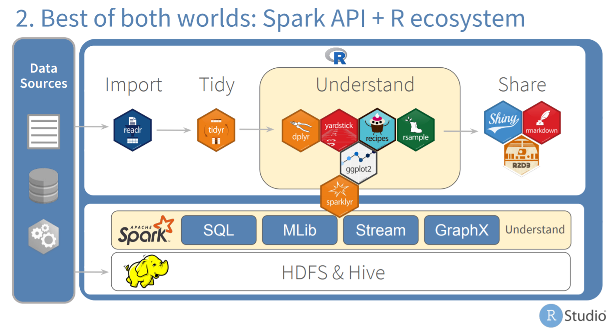

Data Science with Spark and R
-----------------------------------

### Event: Big Data London 2018

**Abstract:** *Have you wondered how to integrate R into your Big Data platform? This talk will review the latest R packages, capabilities and techniques that will allow you to connect these two key pieces of your data practice. Learn how it is possible now for an R user to analyze data inside the cluster without importing it into memory, run Spark models, create true Spark Pipelines, and all without leaving the R interface, nor the R language.*

**Contents:** R Notebook and presentation deck
